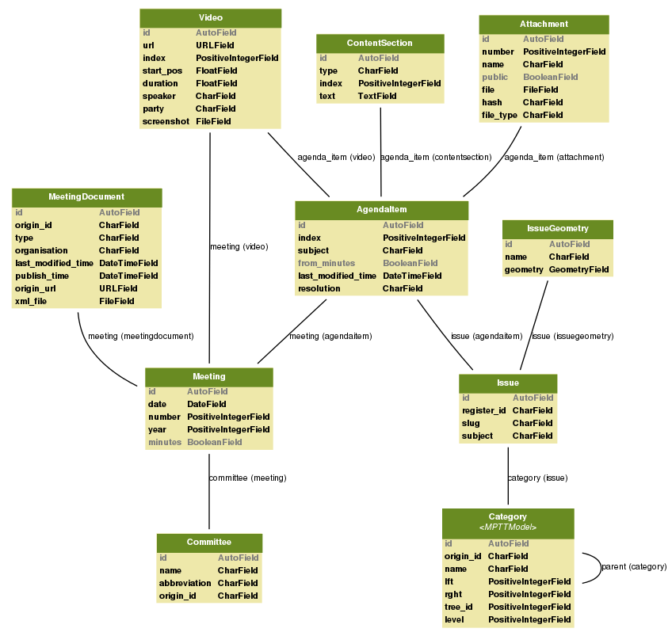

[](https://travis-ci.org/City-of-Helsinki/openahjo)
[](https://codecov.io/gh/City-of-Helsinki/openahjo)

OpenAhjo API
============

API and UI for accessing the decision-making material of the City of Helsinki.
The backend is RESTful and based on [Django](https://www.djangoproject.com/) and
[Tastypie](http://tastypieapi.org/). The HTML5 frontend
utilizes the REST API and is written mostly in [CoffeeScript](http://coffeescript.org/).

Background
----------
The [City of Helsinki](http://www.hel.fi/) has decided to open the data related to decision making
inside the city. In the first phase, the focus is on political decision
makers, e.g. committees, the city board and the city council. During the
second phase (to be completed in 2013), data from all non-political civil
servant decision makers will be opened, as well.

The original data is provided in zipped XML format. The data is available from
the [OpenAhjo web server](http://openhelsinki.hel.fi/files/). The ZIP files are
in subdirectories based on the committee name and ID. The ZIP file includes also
other types of files such as the attachment documents (mostly PDF) to the agenda
items.

This project automatically scans through the original repository periodically,
imports the XML, cleans it up and augments the data with other information
such as geospatial geometries. It then serves the content in linked data format
over a REST API.

API
---

The API specification is automatically generated by [django-tastypie-swagger](https://github.com/concentricsky/django-tastypie-swagger). A live version lives at [http://dev.hel.fi/openahjo/doc](http://dev.hel.fi/openahjo/doc
).

The API is composed of the resources described below.

### policymaker

An entity making decisions. For example:

```
http://dev.hel.fi/openahjo/v1/policymaker/1/?format=json
```
```json
{
    "id": 1,
    "name": "Tarkastuslautakunta",
    "origin_id": "00311",
    "resource_uri": "/openahjo/v1/committee/1/"
}
```

### meeting

Meeting of a political committee. A meeting is uniquely identified by committee,
year and meeting number (within the year).

```
http://dev.hel.fi/openahjo/v1/meeting/5/?format=json
```
```json
{
    "policymaker": "/openahjo/v1/policymaker/26/",
    "policymaker_name": "Asuntotuotantotoimikunta",
    "date": "2013-05-08",
    "id": 5,
    "minutes": false,
    "number": 6,
    "resource_uri": "/openahjo/v1/meeting/5/",
    "year": 2013
}
```

### issue

An issue being discussed and decided on at different committee meetings. One
issue can be discussed in several different meetings. The resource `agenda_item`
links issues to meetings.

```
http://dev.hel.fi/openahjo/v1/issue/148/?format=json
```
```json
{
    "category": "/openahjo/v1/category/419/",
    "category_name": "Asemakaavoitus",
    "category_origin_id": "10 03 03",
    "geometries": [
        {
            "coordinates": [24.93393763640416, 60.16417504680238],
            "name": "Albertinkatu 27",
            "type": "Point"
        }
    ],
    "id": 148,
    "register_id": "HEL 2011-004632",
    "resource_uri": "/openahjo/v1/issue/148/",
    "slug": "hel-2011-004632",
    "subject": "Kampin tontin 72/2 asemakaavan muuttaminen (nro 12145; Albertinkatu 27 b)",
    "summary": "Asemakaavan muutosehdotus mahdollistaa liikerakennusten korttelialueen muuttamisen asuin-, liike- ja toimistorakennusten korttelialueeksi. Tontin rakennusoikeuden määrä 2575 k-m2 ja suurin sallittu kerrosluku 5 säilyvät ennallaan. Maantasokerros säilyy myymäläkäytössä. Lisäksi ullakkotasolle saadaan sijoittaa joitakin pääkäyttötarkoituksen mukaisia tiloja ja sinne tulee sijoittaa asukkaiden oleskeluun tarkoitettuja tiloja, kuten talosauna, jota kuitenkaan ei lueta em. rakennusoikeuteen. Kaava mahdollistaa tontilla nykyisin sijaitsevan rakennuksen säilyttämisen mutta rakennusta ei kaavassa suojella. Olemassa olevan rakennuksen rakennusoikeus on noin 1000 k-m2 suurempi kuin asemakaavaehdotuksen rakennusoikeus."
}
```

### issue search

The issue resource also provides a search interface. The interface includes Solr-powered full-text, spatial and faceted search capabilities. The following parameters are accepted:

`limit`, `page`

Allows specifying how many results and which page of results to return.

`text`

Full-text search terms. The parameter is passed to Haystack's [auto_query](https://django-haystack.readthedocs.org/en/latest/searchqueryset_api.html#auto-query), so it supports negation, exact matches etc.

`category`

Limits search to issues from given category id.

`district`

Limits search to issues from given districts. Multiple district ids can be given separated by commas.

`bbox`

Limits search geospatially to the given bounding box (left, bottom, right, top in standard WGS-84 coordinate format).

`order_by`

Specifies in which order the returned results should be. Currently only supports `latest_decision_date`, `-latest_decision_date` and `relevance`.

```
http://dev.hel.fi/openahjo/v1/issue/search/?text=guggenheim&format=json
```

### category

All the issues are under one category each. The [category list](data/categories.csv)
was made by scraping a PDF.

### agenda_item

Agenda item describes an item on a meeting agenda. An agenda item always links
to one `issue`. The textual content often differs based the meeting and committee,
so the content in stored in `agenda_item` instead of `issue`. Contents of `issue`
and `meeting` are copied into `agenda_item` in order to accommodate fewer API
accesses.

```
http://dev.hel.fi/openahjo/v1/agenda_item/1/?format=json
```
```json
{
    "attachments": [
        {
            "agenda_item": "/openahjo/v1/agenda_item/1/",
            "file_type": "pdf",
            "file_uri": "http://dev.hel.fi/openahjo/media/att/2b4dca8e2ee0467353205b55c47aa44cbf6500b8.pdf",
            "hash": "2b4dca8e2ee0467353205b55c47aa44cbf6500b8",
            "id": 1,
            "name": "Asunto Oy Hietalahdenkatu 12",
            "number": 1,
            "public": true,
            "resource_uri": "/openahjo/v1/attachment/1/"
        }
    ],
    "content": [
        {
            "text": "<p>Lautakunta päätti puoltaa Asunto Oy Hietalahdenkatu 12:sta perusparannushankkeen korkotukilainahakemusta.</p>",
            "type": "resolution"
        }, {
            "text": "<p>Asunto Oy Hietalahdenkatu 12 on jättänyt korkotukilainahakemuksen lämmitysjärjestelmän osittaiseen uusimiseen sekä vesi- ja viemärijohtojen uusimiseen. Hankkeessa on 69 asuntoa ja asuntoala on 2368 asm². Rakennus on valmistunut vuonna 1918.</p> <p>Asumisen rahoitus- ja kehittämiskeskus varaa käytettävissä olevien myöntämisvaltuuksien mukaan korkotukilainat kunnan puoltamille hankkeille.</p> <p>Esittelijän näkemyksen mukaan hakemusta tulisi puoltaa.</p>",
            "type": "presenter"
        }
    ],
    "from_minutes": true,
    "id": 1,
    "index": 35,
    "issue": {
        ...
    },
    "last_modified_time": "2013-04-30T11:02:00",
    "meeting": {
        ...
    },
    "resource_uri": "/openahjo/v1/agenda_item/1/"
}
```

### video

Currently, the city council meetings are recorded on video. One `video` resource
can either point to the whole recording (`agenda_item` is null), to the processing
of an agenda item (`index` is 0) or to an individual statement by a speaker
(`index` is non-zero and `speaker` is defined).

Supports filtering on `agenda_item`, `meeting` and `speaker`.

```
http://dev.hel.fi/openahjo/v1/video/2409/?format=json
```
```json
{
    "agenda_item": "/openahjo/v1/agenda_item/3219/",
    "duration": 63,
    "id": 2409,
    "index": 3,
    "meeting": "/openahjo/v1/meeting/19/",
    "party": "",
    "resource_uri": "/openahjo/v1/video/2409/",
    "screenshot_uri": "http://dev.hel.fi/openahjo/media/video/6-2013/item5-3.jpg",
    "speaker": "Pajunen Jussi",
    "start_pos": 2327,
    "url": "http://media.helsinkikanava.fi/valtuusto270313.mp4"
}
```

Models
------


Installation
------------
Required Debian packages:

    language-pack-fi postgis postgresql-9.1-postgis libxml2-dev libxslt1-dev libavcodec-dev libavformat-dev libswscale-dev python-imaging

Shell commands:

    sudo su postgres
    createuser -R -S -D -P openahjo
    createdb -O openahjo -T template0 -l fi_FI.UTF8 -E utf8 openahjo
    psql openahjo

PostgreSQL commands:

    CREATE EXTENSION postgis;
    CREATE EXTENSION postgis_topology;

After the database is created, you need to create the tables:

    ./manage.py syncdb --all
    ./manage.py migrate --fake

Then you can just populate your tables (this will take a while):

    ./manage.py ahjo_import

Configuration
-------------

You might want to enable logging by modifying local_settings.py as follows:

```python
LOGGING = {
    'version': 1,
    'disable_existing_loggers': True,
    'formatters': {
        'verbose': {
            'format': '%(levelname)s %(asctime)s %(module)s %(process)d %(thread)d %(message)s'
        },
        'simple': {
            'format': '%(module)s %(asctime)s %(levelname)s %(message)s'
        },
    },
    'handlers': {
        'null': {
            'level': 'DEBUG',
            'class': 'django.utils.log.NullHandler',
        },
        'console':{
            'level': 'DEBUG',
            'class': 'logging.StreamHandler',
            'formatter': 'simple'
        },
    },   
    'loggers': {
        'django': {
            'handlers': ['console'],
            'level': 'WARNING',
            'propagate': False,
        },
        'generic': {
            'handlers': ['console'],
            'level': 'WARNING',
            'propagate': False,
        },
        'requests': {
            'handlers': ['console'],
            'level': 'WARNING',
            'propagate': False,
        },
        '': {
            'handlers': ['console'],
            'level': 'DEBUG',
            'propagate': False,
        }
    }
}
```
